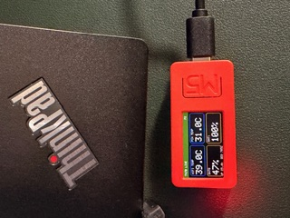
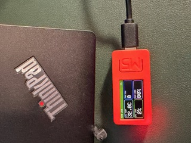
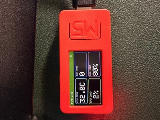
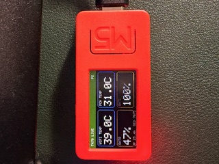

# M5StickC Lenovo T470 Dashboard

This project turns the connected M5StickC into a live external system monitor for the Lenovo T470 on `/dev/ttyUSB0`.

## What is here

- `platformio.ini`: board, serial, monitor, and library configuration
- `src/main.cpp`: M5StickC dashboard firmware
- `lenovo_stats_bridge.py`: host-side telemetry sender that reads Linux stats and streams them to the stick
- `requirements.txt`: Python dependency list for the host bridge

## Photos






## What the dashboard shows

- CPU package temperature
- ThinkPad fan RPM
- CPU load percent
- RAM used percent
- Wi-Fi and PCH temperatures
- Battery percentages for BAT0 and BAT1
- Laptop uptime

## Firmware commands

Build the firmware:

```bash
~/.local/bin/pio run
```

Flash the firmware to the stick:

```bash
~/.local/bin/pio run --target upload
```

## Host telemetry command

Run the Lenovo-to-M5Stick bridge:

```bash
python3 lenovo_stats_bridge.py
```

Install the Python dependency if needed:

```bash
python3 -m pip install -r requirements.txt
```

Optional flags:

```bash
python3 lenovo_stats_bridge.py --port /dev/ttyUSB0 --interval 1.0
```

## Device controls

- Button A: switch dashboard page
- Button B: dim or brighten the display
- LED on: waiting for host data or data is stale
- LED off: receiving live host updates

## Backup and restore

Re-read the full flash image for backup:

```bash
~/.local/bin/esptool.py --chip esp32 --port /dev/ttyUSB0 --baud 115200 read_flash 0x000000 0x400000 flash_dump_4mb.bin
```

The raw flash dump is intentionally gitignored and should stay out of GitHub because it may contain proprietary firmware.

## GitHub push

This repo is set up to keep build output, Python cache files, and raw device dumps out of version control.

Initialize and push after creating an empty GitHub repository:

```bash
git add .
git commit -m "Initial M5StickC Plus dashboard"
git remote add origin git@github.com:YOUR_USERNAME/YOUR_REPO.git
git push -u origin main
```

## Notes

The backup image lets us restore the raw flash, but it does not reconstruct the original source project. The dashboard depends on the host script running on the T470, because the M5Stick cannot directly access laptop sensor files by itself.